<div align="center">
  
</div>

<h1 align="center">OpenSight</h1>
<p align="center" style="font-size: 1.2em; color: #666; margin-top: -10px;">
  <strong>Vision Therapy, Reimagined through Dichoptic Gaming and AI</strong>
</p>

<div align="center">
  
  
  
  
  
  
</div>

---

## The Problem We Solve

Traditional vision therapy requires expensive clinical equipment and regular visits to specialists, creating barriers to consistent treatment for millions suffering from **Amblyopia**, **Strabismus**, and **Convergence Insufficiency**. 

OpenSight bridges this gap by transforming standard screens and $2 Red/Blue glasses into a powerful therapeutic platform, making clinically-inspired exercises accessible from home.

---

## Overview

OpenSight delivers clinically inspired vision therapy through playful, adaptive games and an AI-guided analysis layer. The platform supports two UX modes (Kids and Adults), a configurable Dichoptic Engine, and an AI assistant called **Dr. Sight** for on-demand guidance and interpretation.

---

## How It Works: The Flow

```mermaid
graph TD
    A[User Log In] --> B{Age Group?}
    B -- Kid --> C[🚀 Mission Control UI]
    B -- Adult --> D[📊 Clinical Dashboard UI]
    C --> E[Select Game]
    D --> E
    E --> F{Dichoptic Render}
    F -- Left Eye Weak --> G[🔴 Red Target / 🔵 Blue Lock]
    F -- Right Eye Weak --> H[🔵 Blue Target / 🔴 Red Target]
    F -- Fusion Training --> I[🟣 Purple Target]
    G --> J[🎮 Play Game]
    H --> J
    I --> J
    J --> K[Save Score & Streak]
    K --> L[AI Dr. Sight Analysis]
```



---

## Core Features

### 1. 🎯 The Dichoptic Engine
> **Logic Core**: A custom React hook drives the entire visual system based on the user's medical profile, enabling precise color separation for therapeutic effect.

- **Left Weak**: Target = 🔴 Red; Lock = 🔵 Blue  
- **Right Weak**: Target = 🔵 Blue; Lock = 🔴 Red  
- **Fusion**: Target = 🟣 Purple (requires both eyes to work together)

### 2. 👥 Dual UI System
- **Kids Mode**: Bright colors, Captain ranks, badges, and Mission Control interface (Nunito font)  
- **Adults Mode**: Clean Clinical Dashboard, progress charts, and data focus (Inter font)

#### Neuroplasticity & UX
The dual-mode design is medically significant for patient adherence. Children engage better with gamified elements and rewards, while adults respond to data-driven progress tracking and clinical terminology. This tailored approach maximizes neuroplasticity through consistent engagement.

### 3. 🤖 AI Dr. Sight
- Powered by Llama 3.1 via Groq with a **local fallback knowledge base**  
- Provides detailed medical guidance and instant answers to therapy questions  
- **Resilient Architecture**: Ensures basic guidance when the API is unavailable

### 4. 🎬 Cinema Mode
- Games run in a dedicated immersive HUD  
- Full-screen canvas with `object-fit: contain`  
- Floating glassmorphism controls to maximize therapeutic field of view

---

## Game Suite Gallery

| 🎮 Game | 🎯 Condition Treated | ⚡ Mechanic |
|---|---|---|
| 🐍 Snake | Amblyopia | Eye Tracking & Smooth Pursuit |
| 🏎️ Racing | Amblyopia | Reaction Time & Anti-Suppression |
| 🧩 Tetris | Strabismus | Spatial Planning & Fusion |
| 🌊 Sea Explorer | Contrast Sensitivity | Finding faint objects in deep blue |
| 🎯 Zooming Target | Convergence | Crossing/Uncrossing eyes (Vergence) |
| 🔨 Whack-a-Target | Tracking | Rapid Saccades (Reading skills) |
| 💡 Lighthouse | Visual Neglect | Scanning into the blind side |

---

## Tech Stack

- **Frontend**: React (Vite), Tailwind CSS, Framer Motion, HTML5 Canvas  
- **Backend**: Node.js, Express.js  
- **Database**: MongoDB (Mongoose), GridFS  
- **Auth**: Custom JWT Implementation (secure & lightweight)  
- **AI**: Groq SDK (Llama 3.1 8b)

---

## Quick Start

### Backend Setup

```bash
cd backend
npm install

# Create a .env file with:
# MONGO_URI=your_mongodb_url
# JWT_SECRET=your_secret
# GROQ_API_KEY=your_key

npm run dev
# Backend runs on http://localhost:50002
```

### Frontend Setup

```bash
cd frontend
npm install

# Create a .env file with:
# VITE_API_URL=http://localhost:5000/api

npm run dev
# Frontend runs on http://localhost:5173
```

---

## API Reference

| Method | Endpoint | Description |
|---|---|---|
| POST | /api/auth/register | Register new patient |
| POST | /api/chat | Talk to AI Dr. Sight |
| PATCH | /api/user/config | Update weak eye / difficulty |
| POST | /api/game/score | Save game performance |

---

## Project Structure

```bash
backend/
 ├── controllers/    # Game logic & AI handlers
 ├── models/         # User & Score Schemas
 ├── routes/         # API Endpoints
 └── server.js       # Entry point

frontend/src/
 ├── components/     # Games (Snake, Racing, etc.)
 ├── hooks/          # useTherapyColors (The Logic Core)
 ├── layouts/        # DashboardLayout (Kids vs Adult logic)
 └── pages/          # Dashboard, Settings, GamePage
```

---

## Development Notes

- **Dichoptic Hook**: Keep the hook pure and driven by a single `userProfile` object. Expose color tokens and contrast parameters.  
- **Cinema Mode Canvas**: Use a responsive canvas wrapper and scale game objects relative to the canvas logical size to preserve therapeutic geometry across devices.  
- **AI Integration**: Wrap Groq calls with a resilient service that falls back to a local knowledge base when the remote API fails. Log queries for later review and anonymized model improvement.  
- **Security**: Use HTTPS in production, rotate `JWT_SECRET`, and validate tokens on every protected route. Sanitize and validate all user inputs server-side.

---

## Deployment

<div align="center">
  <a href="https://visionfront.onrender.com" style="background-color: #10B981; color: white; padding: 12px 24px; text-decoration: none; border-radius: 8px; font-weight: bold; margin-left: 10px;">
    🐳 Deploy to Render
  </a>
</div>

---

## Join the Vision

We're looking for passionate contributors to help democratize vision therapy:

- **👨‍💻 Developers**: Help us expand the game suite and improve the Dichoptic Engine
- **👩‍⚕️ Clinicians**: Provide medical insights and validate therapeutic effectiveness  
- **🎨 UX Designers**: Enhance patient engagement and adherence through better design
- **📊 Data Scientists**: Analyze therapy outcomes and improve AI recommendations

---

## Contributing

- **Issue First**: Open an issue describing the feature or bug. Include reproduction steps for bugs.  
- **Branching**: Use `feature/` or `fix/` prefixes. Keep PRs focused and small.  
- **Testing**: Add unit tests for game logic and integration tests for API endpoints.  
- **Code Style**: Follow the existing ESLint and Prettier configuration. Run `npm run lint` and `npm run test` before submitting a PR.

---

## License

**OpenSight** is released under the **MIT License**. See the LICENSE file for full terms.

---

