<div align="center">
  
</div>

<h1 align="center">OpenSight</h1>
<p align="center" style="font-size: 1.2em; color: #666; margin-top: -10px;">
  <strong>Vision Therapy, Reimagined through Dichoptic Gaming and AI</strong>
</p>

<div align="center">
  
  
  
  
  
  
</div>

---

## 🎥 Demo & Visuals

### Video Walkthrough
[](https://www.youtube.com/watch?v=DAcgy-Zxv48&feature=youtu.be)

*Click the badge above to see OpenSight’s Dichoptic Engine and Dr. Sight Assistant in action.*

### Interface Gallery
| **Pediatric Pilot Mode (Kids)** | **Clinical Dashboard (Adults)** |
|:---:|:---:|
|  |  |
| *Gamified ranks and high-engagement mission interface.* | *Data-driven progress tracking and clinical charts.* |

---

## The Problem We Solve

Traditional vision therapy requires expensive clinical equipment and regular visits to specialists, creating barriers for millions suffering from **Amblyopia**, **Strabismus**, and **Convergence Insufficiency**. 

OpenSight bridges this gap by transforming standard screens and $2 Red/Blue glasses into a powerful therapeutic platform, making clinically-inspired exercises accessible from home.

---

## How It Works: The Flow

```mermaid
graph TD
    A[User Log In] --> B{Age Group?}
    B -- Kid --> C[🚀 Mission Control UI]
    B -- Adult --> D[📊 Clinical Dashboard UI]
    C --> E[Select Game]
    D --> E
    E --> F{Dichoptic Render}
    F -- Left Eye Weak --> G[🔴 Red Target / 🔵 Blue Lock]
    F -- Right Eye Weak --> H[🔵 Blue Target / 🔴 Red Target]
    F -- Fusion Training --> I[🟣 Purple Target]
    G --> J[🎮 Play Game]
    H --> J
    I --> J
    J --> K[Save Score & Streak]
    K --> L[AI Dr. Sight Analysis]
```

[Image of a flow chart showing user login, age group selection, game selection, dichoptic rendering, and score saving]




OpenSight is a specialized vision therapy ecosystem designed to democratize eye care by transforming medical exercises into an engaging, high-performance arcade. We bridge the "Compliance Gap" in vision therapy—making treatment addictive through gamification rather than exhaustive through drills.

---

## Core Features

### 1. 🎯 The Dichoptic Engine
**Logic Core**: A custom React hook (`useTherapyColors`) drives the entire visual system based on the user's medical profile, enabling precise color separation for therapeutic effect.

* **Left Weak**: Target = 🔴 Red; Lock = 🔵 Blue
* **Right Weak**: Target = 🔵 Blue; Lock = 🔴 Red
* **Fusion**: Target = 🟣 Purple (requires both eyes to work together)

### 2. 👥 Dual UI System
The platform supports two distinct UX modes tailored to patient adherence and neuroplasticity:
* **Kids Mode**: Bright colors, "Captain" ranks, and a Mission Control interface.
* **Adults Mode**: Clean Clinical Dashboard with progress charts and a professional data focus.

### 3. 🤖 AI Dr. Sight
* Powered by **Llama 3.1** via Groq with a **local fallback knowledge base** to ensure reliability.
* Provides detailed medical guidance and instant answers to therapy questions.
* **Resilient Architecture**: Ensures basic guidance is available even if the remote API is offline.

### 4. 🎬 Cinema Mode
* Games run in a dedicated immersive HUD with full-screen canvas support.
* Features floating glassmorphism controls to maximize the therapeutic field of view.

---

## Game Suite Gallery

| 🎮 Game | 🎯 Condition Treated | ⚡ Mechanic |
| :--- | :--- | :--- |
| 🐍 **Snake** | Amblyopia | Eye Tracking & Smooth Pursuit |
| 🏎️ **Racing** | Amblyopia | Reaction Time & Anti-Suppression |
| 🧩 **Tetris** | Strabismus | Spatial Planning & Fusion |
| 🌊 **Sea Explorer** | Contrast Sensitivity | Finding faint objects in deep blue |
| 🎯 **Zooming Target**| Convergence | Crossing/Uncrossing eyes (Vergence) |
| 🔨 **Whack-a-Target** | Tracking | Rapid Saccades (Reading skills) |
| 💡 **Lighthouse** | Visual Neglect | Scanning into the blind side |

---

## 🚀 Future Roadmap

* **VR (WebXR) Support**: Implementing native image separation for VR headsets to eliminate the need for Red/Blue glasses.
* **Clinical Trials**: Partnering with optometrists to validate game-based acuity improvements.
* **Worth 4-Dot Diagnostic**: Integrating a digital version of the clinical suppression test.
* **Mobile PWA**: Enabling offline therapy sessions and a dedicated mobile experience.
* **💎 Web3 Incentivization Layer ($SIGHT)** Implementing an ERC-20 token reward system on the Polygon network. Patients will earn "Sight Credits" for maintaining daily therapy streaks, which can be redeemed for premium themes or donated to fund vision care for others. This "Play-to-Heal" model directly addresses the challenge of patient compliance.

---

## Tech Stack

* **Frontend**: React (Vite), Tailwind CSS, Framer Motion, HTML5 Canvas.
* **Backend**: Node.js, Express.js.
* **Database**: MongoDB (Mongoose).
* **AI**: Groq SDK (Llama 3.1 8b).

---

## Quick Start

### Backend Setup
```bash
cd backend
npm install
# Configure .env with MONGO_URI, JWT_SECRET, and GROQ_API_KEY
npm run dev
```

### Frontend Setup
```bash
cd frontend
npm install
# Configure .env with VITE_API_URL
npm run dev
```
### Deployment
<div align="center"> <a href="https://visionfront.onrender.com">  </a> </div>

### License
OpenSight is released under the MIT License. See the LICENSE file for full terms.
