### OpenSight README

`https://img.shields.io/badge/license-MIT-green`  
`https://img.shields.io/badge/MERN-Full%20Stack-blue`  
`https://img.shields.io/badge/Status-Hackathon%20Ready-orange`  
`https://img.shields.io/badge/AI-Llama%203.1-purple`

**OpenSight** is a free, open-source, browser-based platform that gamifies clinically inspired exercises for **Amblyopia**, **Strabismus**, and **Convergence Insufficiency**.  
We replace expensive medical equipment with **standard screens and $2 Red/Blue glasses**, powered by an intelligent Dichoptic Engine.

---

#### Overview

OpenSight delivers clinically inspired vision therapy through playful, adaptive games and an AI-guided analysis layer. The platform supports two UX modes (Kids and Adults), a configurable Dichoptic Engine, and an AI assistant called **Dr. Sight** for on-demand guidance and interpretation.

---

#### How It Works The Flow

```mermaid
graph TD
    A[User Log In] --> B{Age Group?}
    B -- Kid --> C[🚀 Mission Control UI]
    B -- Adult --> D[📊 Clinical Dashboard UI]
    C --> E[Select Game]
    D --> E
    E --> F{Therapy Engine}
    F -- Left Eye Weak --> G[🔴 Red Target / 🔵 Blue Lock]
    F -- Right Eye Weak --> H[🔵 Blue Target / 🔴 Red Target]
    F -- Fusion Training --> I[🟣 Purple Target]
    G --> J[🎮 Play Game]
    H --> J
    I --> J
    J --> K[Save Score & Streak]
    K --> L[AI Dr. Sight Analysis]
```



---

#### Core Features

1. **The Dichoptic Engine useTherapyColors**  
   - We don't hardcode colors. A custom React hook drives the entire visual system based on the user's medical profile.  
   - **Left Weak**: Target = 🔴 Red; Lock = 🔵 Blue  
   - **Right Weak**: Target = 🔵 Blue; Lock = 🔴 Red  
   - **Fusion**: Target = 🟣 Purple (requires both eyes to work together)

2. **Dual UI System**  
   - **Kids Mode**: Bright colors, Captain ranks, badges, and Mission Control interface (Nunito font).  
   - **Adults Mode**: Clean Clinical Dashboard, progress charts, and data focus (Inter font).

3. **AI Dr. Sight**  
   - Powered by Llama 3.1 via Groq with a local fallback knowledge base.  
   - Provides detailed medical guidance and instant answers to therapy questions.  
   - Local fallback ensures basic guidance when the API is unavailable.

4. **Cinema Mode**  
   - Games run in a dedicated immersive HUD.  
   - Full-screen canvas with `object-fit: contain`.  
   - Floating glassmorphism controls to maximize therapeutic field of view.

---

#### Game Suite

| Game | Condition Treated | Mechanic |
|---|---|---|
| Snake | Amblyopia | Eye Tracking & Smooth Pursuit |
| Racing | Amblyopia | Reaction Time & Anti-Suppression |
| Tetris | Strabismus | Spatial Planning & Fusion |
| Sea Explorer | Contrast Sensitivity | Finding faint objects in deep blue |
| Zooming Target | Convergence | Crossing/Uncrossing eyes (Vergence) |
| Whack-a-Target | Tracking | Rapid Saccades (Reading skills) |
| Lighthouse | Visual Neglect | Scanning into the blind side |

---

#### Tech Stack

- **Frontend**: React (Vite), Tailwind CSS, Framer Motion, HTML5 Canvas  
- **Backend**: Node.js, Express.js  
- **Database**: MongoDB (Mongoose), GridFS  
- **Auth**: Custom JWT Implementation (secure & lightweight)  
- **AI**: Groq SDK (Llama 3.1 8b)

---

#### Quick Start

##### Backend Setup

```bash
cd backend
npm install

# Create a .env file with:
# MONGO_URI=your_mongodb_url
# JWT_SECRET=your_secret
# GROQ_API_KEY=your_key

npm run dev
# Backend runs on http://localhost:50002
```

##### Frontend Setup

```bash
cd frontend
npm install

# Create a .env file with:
# VITE_API_URL=http://localhost:5000/api

npm run dev
# Frontend runs on http://localhost:5173
```

---

#### API Reference

| Method | Endpoint | Description |
|---|---|---|
| POST | /api/auth/register | Register new patient |
| POST | /api/chat | Talk to AI Dr. Sight |
| PATCH | /api/user/config | Update weak eye / difficulty |
| POST | /api/game/score | Save game performance |

---

#### Project Structure

```bash
backend/
 ├── controllers/    # Game logic & AI handlers
 ├── models/         # User & Score Schemas
 ├── routes/         # API Endpoints
 └── server.js       # Entry point

frontend/src/
 ├── components/     # Games (Snake, Racing, etc.)
 ├── hooks/          # useTherapyColors (The Logic Core)
 ├── layouts/        # DashboardLayout (Kids vs Adult logic)
 └── pages/          # Dashboard, Settings, GamePage
```

---

#### Development Notes

- **Dichoptic Hook**: Keep the hook pure and driven by a single `userProfile` object. Expose color tokens and contrast parameters.  
- **Cinema Mode Canvas**: Use a responsive canvas wrapper and scale game objects relative to the canvas logical size to preserve therapeutic geometry across devices.  
- **AI Integration**: Wrap Groq calls with a resilient service that falls back to a local knowledge base when the remote API fails. Log queries for later review and anonymized model improvement.  
- **Security**: Use HTTPS in production, rotate `JWT_SECRET`, and validate tokens on every protected route. Sanitize and validate all user inputs server-side.

---

#### Contributing

- **Issue First**: Open an issue describing the feature or bug. Include reproduction steps for bugs.  
- **Branching**: Use `feature/` or `fix/` prefixes. Keep PRs focused and small.  
- **Testing**: Add unit tests for game logic and integration tests for API endpoints.  
- **Code Style**: Follow the existing ESLint and Prettier configuration. Run `npm run lint` and `npm run test` before submitting a PR.

---

#### License

**OpenSight** is released under the **MIT License**. See the LICENSE file for full terms.

---

